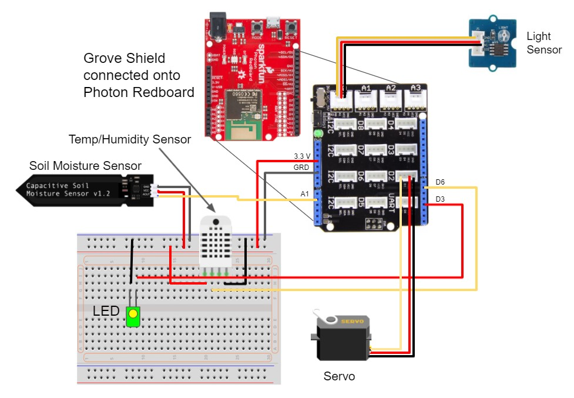

# Responsibilities of the Embedded System
1) Read data from sensors, and post it to the server through WiFi
2) Get control scheme from server, and control actuators (valve and LED) based off server values

# Required Hardware
<table>
    <thead>
        <tr>
            <th>Hardware</th>
            <th>Quantity</th>
        </tr>
    </thead>
    <tbody>
        <tr>
            <td>Sparkfun Photon Redboard</td>
            <td>1</td>
		</tr>
		<tr>
			<td>Seeedstudio Grove for Arduino - Starter Kit V3
				<br />----Seeedstudio Grove Base Shield
				<br />----Seeedstudio Light Sensor
				<br />----Servo (placeholder for watering valve)
				</td>
			<td>1</td>
		</tr>
		<tr>
			<td>Moisture Sensor (<a href="https://www.amazon.com/gp/product/B089RQF371/">Purchased Here</a>)</td>
			<td>1</td>
		</tr>
		<tr>
			<td>Temperature and Humidity Sensor - RHT03</td>
			<td>1</td>
		</tr>
		<tr>
			<td>LED Light</td>
			<td>1</td>
		</tr>
    </tbody>
</table>

# Hardware Connections


# Setup
Open the <a href="https://build.particle.io/build/new">Particle Web IDE</a> and insert embedded code as a new projet
- make sure you are logged into the same account as your Photon Redboard

Add libraries by clicking on the "libraries" icon on the bottom left
- JsonParserGeneratorRK
- HttpClient
- SparkFunRHT03

Flash code using the icon on the top left


# Code modifications
You can manually change the ID of the plant by changing the value on line 64. 

```int plant_id = INSERT_ID_NUMBER_HERE;```

Different plants sending data to the same server should have different ID's

Additionally, you'll need to obtain an access token:
- make sure you have Particle CLI installed on your computer. You can download it <a href="https://docs.particle.io/tutorials/developer-tools/cli/">here</a>
- open a terminal and input the following command: <b>particle token create</b> \
  (you may need to input your password for your Particle account before receiving the token)
- replace your token with the given token on line 19

```String ACCESS_TOKEN = "INSERT_YOUR_TOKEN_HERE";```
